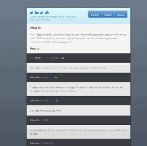

On this page I share my programs, scripts or helpful solutions with you, that help me to achieve successful results. Sometimes you may see here some non-commercial, personal programs created during my free time.

All the same, each of the described programs on this page was written just by myself.

I think a decision of separating the inventions into appropriate groups and categories will be a helpful solution to find specific code faster.

<h2 id="batch" name="batch" class="works-category"> Batch, Shell, WSH </h2>

# Easy Backup

<blockquote>

<u>Technology:</u> batch-scripting. 
 

<b>Github</b>: <a href="https://github.com/asduser/bat-scripts-kit#easy-backup" target="_blank">open repository</a>

</blockquote>

<u>Description:</u>  simple tool to create folders\files backup inside your PC. It may be really helpful when you often need copy a specific folder\files but you dont want do it manually due to time wasting. 

# Logs Cleaner

<blockquote>

<u>Technology:</u> Windows Script Host, batch-scripting. 
 

<b>Github</b>: <a href="https://github.com/asduser/wsh-logs-cleaner" target="_blank">open repository</a>

</blockquote>

<u>Description:</u> fast utility on WSH in order to clear logs after scheduled system or user operations. 

# Password Generator

<blockquote>

<u>Technology:</u> Windows Script Host, batch-scripting. 
 

<b>Github</b>: <a href="https://github.com/asduser/wsh-password-generator" target="_blank">open repository</a>

</blockquote>

<u>Description:</u>  simple, nevertheless, flexible tool in configuration to generate passwords. The final result is written into the corresponding file. You may adjust a new options or edit existing in a special wsh file. 

  

<h2 id="js" name="js" class="works-category"> JavaScript </h2>

# UI Local DB

<blockquote>

<u>Technology:</u> Angular.js 
 

<b>Github</b>: <a href="https://github.com/asduser/angularjs-simple-game" target="_blank">open repository</a>

<b>Web-url</b>: <a href="http://asduser.github.io/ui-local-db/" target="_blank">home page</a>

</blockquote>

  

<u>Description:</u> Fast and helpful library to work with data. Based on the methods of CRUD, so you may use it as instrument to obtain, adjust and modify different data inside your application. 

# qConvert

<blockquote>

<u>Technology:</u> Javascript 
 

<b>Github</b>: <a href="https://github.com/asduser/qConvert-javascript-library" target="_blank">open repository</a>

</blockquote>

<u>Description:</u> that tool will be helpful for devs who often use a different conversion operations with data inside app (replace, invoke, shuffle etc.)

Library has truly a small size and periodically some function structures are changing to improve the common performance. 

# RSS Reader

<blockquote>

<u>Technology:</u> Angular.js, HTML5. 
 
<b>Github</b>: <a href="https://github.com/asduser/rss-reader" target="_blank">open repository</a>
</blockquote>

  

<u>Description:</u> easy to understand tool, by which you may reed you favorites rss or use it as a site widget.

# Arkanoid

<blockquote>

<u>Technology:</u> Angular.js, CANVAS. 
 
<b>Github</b>: <a href="https://github.com/asduser/angularjs-arkanoid-game" target="_blank">open repository</a>
</blockquote>

  

<u>Description:</u> famous game with the possibility of further expansion via Angular.js.

Purpose: ruin all bricks in round to finish successfully.

# Running Boy

<blockquote>

<u>Technology:</u> Javascript, HTML5, CANVAS. 
 
<b>Github</b>: <a href="https://github.com/asduser/running-boy-keyboard" target="_blank">open repository</a>
</blockquote>

  

<u>Description:</u> this is my first experience in Javascript\Canvas game-development. It is a simple keyboard tutor to improve your personal typing skills.
 

There are only one level, but you may adjust a list of settings and dynamically apply it inside application. Enjoy yourself!

# Memory Game

<blockquote>

<u>Technology:</u> Angular.js 
 
<b>Github</b>: <a href="https://github.com/asduser/angularjs-simple-game" target="_blank">open repository</a>
</blockquote>

  

<u>Description:</u> simple game on Javascript when your primary goal is on finding two equal items for some time. 

 Each result will be saved into the statistic table during current session. 

 It was developed on the early stage framework studying, as a consequence the final code could be more effective and elegant :) 

